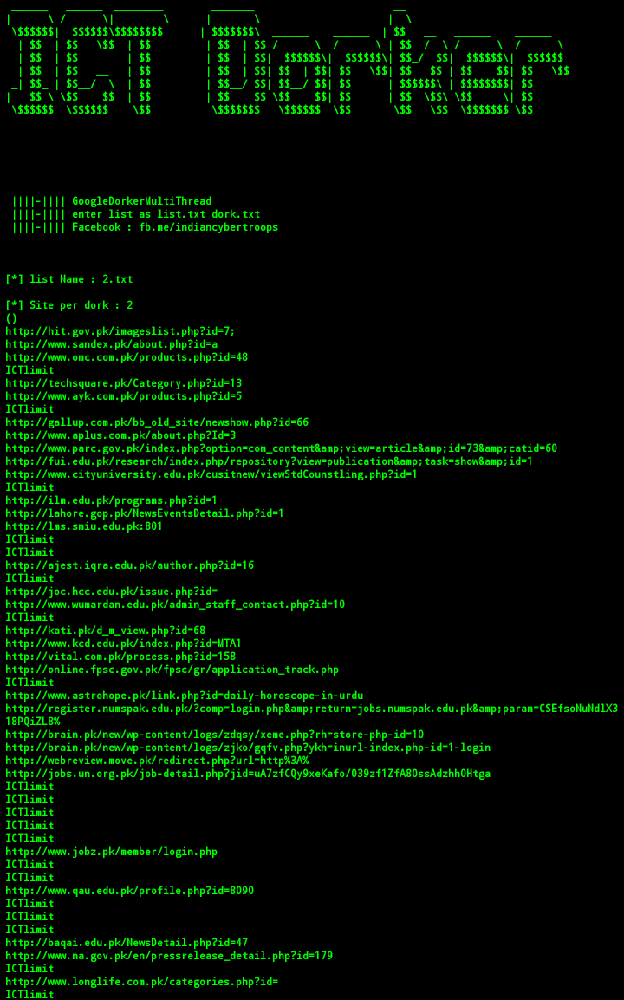

# Multi-Dorker
Multi thread google dorker written in python



## Command to run Dorker on Termux 


```
git clone https://github.com/indiancybertroops/Multi-Dorker/
```
```
cd Multi-Dorker
```
```
chmod +x *
```
```
sh setup.sh
```

```
apt-get install python2
```

```
python2 ICT.py
```


## On linux :

```
git clone https://github.com/indiancybertroops/Multi-Dorker/
```

```
cd Multi-Dorker
```

```
chmod +x *
```

```
sh setup.sh
```

```
python ICT.py
```

## Save your dork txt file as dorks.txt


## sample Dork:
 ```inurl:add.php?id= site:cn```

```inurl:product.php?id= site:pk```
 
```inurl:cat?id= site:uk```
### Any problem In module? 
>Try this 
```
pip2 install colorama
```
>upgrade pip first before this

```
pip install --upgrade pip
```
```
pip2 install --upgrade pip
```
> For Automatically installation of module try this command
```
chmod +x *
```
```
sh setup.sh
```

## Contact Us: 
https://facebook.com/indiancybertroops
https://instagram.com/indiancybertroops


https://twitter.com/indiancybertroops
